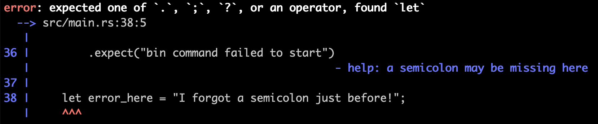

# My journey with Rustlang

## About me
> It's more about personal experience than technical skill.

First of all I want to thank you for taking the time to read this article, it's my first one. I wrote it to **share my personal experience with you**, and tell you about the gap I crossed between **high and low-level development with Rust**. I hope it will help you decide to do the same if you already thought about it.

I am Benoit Chassignol, technical consultant at LinkValue, currently working at M6 Web as **FrontEnd developer on embedded solutions**. I graduated in Multimedia Communication, and I have been working as a graphical designer 3 years. I started my journey as a developer by learning frontend integration by myself, after which I learned more about Javascript with ReactJS, Typescript, and now **Node**.

With that in mind, let's talk about my personal experience as I am about to reach a new turning point in my professional life.

## First contact
> Think different.

The very first time I **heard about Rust was a year and a half ago**. A friend and I were sharing a beer, were discussing about development. He told me he was working on an embedded application in Rustlang. He explained why they chose this technology and how they implemented it on a tiny device with high performance constraints.

I didn't understand anything about that but he was so enthusiastic that I didn't get the courage to tell him, but now he can (and has to) know it, sorry m8! Anyway, he told me to have a look at it, it could be interesting to me because there is a bridge to cross to web applications in Rust: the WebAssembly (WASM) project.

At first, it was not about tech, **it was rather a feeling**. As if something interesting could come out of it and help me in my career path, and in my life. And when he told me more about it, it kind of confirmed how I felt about Rust. **So I gave it a try**. That's how it all started. But, to be honest, I didn't start hacking in Rust immediately, it took me a year. The idea of using **Rust grew in my mind**, it was like an Inception!

## From my point of view
> Make the world safer, one step at a time.

This new language, with some amazing features and with my competences, the WebAssembly could be a good point to start. But no, that wasn't it, **the WASM on Rust wasn't the approach** with which I wanted to discover this new language. It would be amazing to build web application with this, but no. **I want to develop in an other way**, I want to discover something else, I want to develop with a typed system, I want to compile my own code, I want to develop safely, I want to deal with strong hardware constraints, I want to have some very effective performance and, **I just don't want to deal with the memory management**.

In this regard, Rust has, in my opinion, what it takes to be on par with C and C++. It will definitely not completely replace both languages, we don't need to rewrite everything. Maybe we can just make the world safer, one step at a time.

## Here, everything starts
> Neither hard, nor easy.

I have to say a little word about the installation: it's super easy to install Rust on Mac! I didn't try it on Linux but, as far as I've read, it's the same deal. Two command lines, one build and you get a beautiful hello world! Simple and quick as we like.

On windows it's a bit harder, not impossible but it will take you more time, the first thing to do is to download and install [rustup](https://rustup.rs/), it installs Rust from the official release channels. But it need some prerequisites, it will let you know which is missing. For me, I needed to install the C++ build tools. I did it with the embedded solution which consist to get Visual Studio on the [official website](https://visualstudio.microsoft.com/downloads/) of microsoft, install it on your machine. During the installation, it will ask you to install the C++ Build Tools 2019. If you want, you can download and install the Build tools only, just check on the internet. After that, a reboot is needed. Afterwards you can relaunch rustup, it will check if everything is installed correctly. If it is, you can create a new project and your first hello, world! Enter the command line `cargo new hello_world`, go in with `cd hello_world` and run `cargo run`, well played, you made your first (own) Rust project.

At this moment I felt I could hack the whole world. But, not yet. For now I have to learn the basics of Rust. The Rust-book is, in my opinion, the best way to understand the paradigm of the language which may look a little bit tricky at first, but it will be a valuable resource for quite a while.

## High-level to Low-level

### Not a shame
> Share your experience!

As a **FrontEnd developer**, I had to cross a gap, without standard computer science study it's even bigger. As paradoxical as it may seem, I **don't see as a weakness but as a strength**. In my opinion it's essential in a group, in a community, in a company to have many types of profile with different background. That will allow it to **have many views and ideas**. That's why it's not a pain in the a** to have a "non standard" background, I understood it not so long ago. I got it at the RustFest in Barcelona when some bearded man paying attention to my way and said: "Very cool, **you have to share your experience**, because it means everything is possible!", "Ahem, ow thanks.".

### Prepare yourself
> Don't take it personal.

I took it for what it was, a compliment, that's why I am sharing it with you. I could say: "Hi, **try Rust it will make your life wonderfull**, you will have some fun, you will love to code as a low level developer with a high level paradigm, you will compile it and it's going to be fast." but it **won't be true, not at the beginning**. It could be closer to: "Hi my little new Rustaceans, oh, wherever you come from, embark on a journey, you will discover another world. Keep cool and prepare yourself to fix your code, the compiler will say it many times, but stay strong it will be alright. **It will be alright** because it will explicitly tell you what is not correct, and how to fix it. It's not personal, **the compiler has your back!**"

### You know nothing
> There is no magic trick.

The first difficulty **I encounter my ignorance** about the operation of a computer. **I never cared about it**. Knowing that it worked was enough for me and I didn't really need to have that knowledge for my daily work. **Now it's a little bit different**, I have to know what is and how a byte works, how the memory works, how work a CPU, what is a pointer, a reference to it,  what is a thread, the difference with the asynchronous run-time, how a garbage collector works, all of that to understand the basics. I need it now because **I want to learn how Rust deeply works**, particulary how it deal with the memory, why and how it permit us to work safely with it. I discover a big thing about low-level development, it's not magic! 

### To be or (not) to be
> Low level care about length and sign.

Deal with the **data type, as a web developer**, it's not really natural, you might encounter it, but not really deeply. If you haven't code with typescript **you don't really need it** on your code, it's a good thing to know a little bit about it, but it's not a constraint. To illustrate my purpose, you can manipulate your data as you want. It could be scaring for some developers, but you can get platypus in entry and an unicorn in exit. I don't recommend to try it at home and even less at work!

The [type system](https://doc.rust-lang.org/1.30.0/book/2018-edition/ch03-02-data-types.html) **in Rust is a little bit different** from Typescript because you have, for the integer as example, to set the bit length and the sign of it, like u32 / i8 which are respectively an unsigned / signed integer stored on 32-bits / 8-bits. The characters chain can be handle in two different way, as str or as String, the big difference is that the first is a hardcoded value, the second is the dynamic heap string type (you can own it).

### Reuse
> Don't duplicate code, extract.

All along my career, the developers I worked with, told me, with more or less kindness, the same things: "If you can duplicate, **you can extract**.", it's very tempting and easy to duplicate, but it's not efficient and very unsightly. **In Rust**, it's not only a way to develop, to think of your project, there are **tools to help and allow us to do it**. Strongly typed languages mean we will use data types anyway, but we can leverage the **power of [generics](https://doc.rust-lang.org/1.30.0/book/2018-edition/ch10-01-syntax.html)** in order to write a function once, and use it with different types. It might seem tricky to use at first, but it's not as hard to understand as it seems, and it will feel like you have superpowers! We can also leverage **[traits](https://doc.rust-lang.org/1.30.0/book/2018-edition/ch10-02-traits.html) to define a behavior** (a function), and have a different for each type that implements a given trait.

### Know your ~~enemy~~ best friend
> Not a cost, an investment.

Now we are not without knowing that **Rust get our back** about the memory safety, without any garbage collector, it's a part of the reasons it has a very fast run-time, the question is, how he can do that? The answer is the **central feature in Rust, [Ownership](https://doc.rust-lang.org/1.30.0/book/2018-edition/ch04-01-what-is-ownership.html)**. When I got it, I understood more easily the other features that make **Rust unique** compared to other languages. Because it's a new concept for me, and many developers, it took me time to **become confident with** it, the more my learning curve was efficient. Trust me, this feature is not a cost, it's an investment for yourself.

### To resume
> It's only the beginning!

By **learning Rust** I encounter some difficulties at first which weren't related to itself, it was more about my personal **capabilities to understand**, and to master the environment and the constraint of **low-level** developer's. The first thing I've done was to make sure to have the good knowledge. In the end, I saved many time, energy and made me able to identify more easily all the little **subtlety of Rust**. The second thing was to learn the very basics about Rust, immutability by default, data types, pattern matching, structs, generics, traits... Now I learn some Rust features like Ownership, async/await, concurrency... it's where I am and **it's only the beginning!**

## Share must go on

> They will always belong to you, even after sharing.

- The official [Rust-Book](https://doc.Rust-lang.org/book/title-page.html), it explain the language with the words and the vision of his creators.
- The official [Rust by example](https://doc.rust-lang.org/stable/rust-by-example/) is a collection of runnable examples. Nice to discover the concepts and standard libraries of Rust.
- The official [Cargo-Book](https://doc.Rust-lang.org/cargo/index.html) give you all the information you need about Cargo, the Rust package manager.
- WebAssembly [website](https://webassembly.org/) and the official [Rust with WASM](https://rustwasm.github.io/docs/book/).
- A curated list of Rust code and resources on github, [rust-unofficial/awesome-rust](https://github.com/rust-unofficial/awesome-rust).
- A friend freshly, met ~~over a beer~~ at Barcelona has his own youtube channel speaking about Rust, you can check his video [here](https://www.youtube.com/channel/UCZ_EWaQZCZuGGfnuqUoHujw) and follow him on twitter [@matthiasendler](https://twitter.com/matthiasendler).
- For the frenchies, you can learn with the [tutorial](https://blog.guillaume-gomez.fr/Rust/1/1) of [@imperio](https://twitter.com/imperioworld_), which his a second approach, more technical than the official docs.

You have now the **online ressources** I used to learn the basics of Rust. You will discover and learn more about this language, it will be cool, it's going to make you good technicians, but **that's not everything**. From my point of view it's missing an important thing, maybe the most important.

Do you remember, **the developer** with whom I shared a beer earlier? He is my biggest **ressource of knowledge**, Jeremy [@o0Ignition0o](https://twitter.com/o0ignition0o) Lempereur. He's one who made me discover, learn, share my knowledge of development and especially on the low-level. My second biggest ressource is **the rust community**, I thank them to be amazing, to open their doors in a simple and benevolent way, **without judgment.** Very impressive. 

That's exactly where I was going in my article, we all have **knowledge**, **skills** and **experiences** to share. They **will always belong to you**, even **after sharing**, and even better others can **strengthen you with theirs**. These are our strengths, **open sourced them**, it's worth it.

## Author
Benoit [@oScape_](https://twitter.com/oScape_) Chassignol, technical consultant at LinkValue, currently working at M6 Web as FrontEnd developer on embedded solution.

Thanks to Rémi, Tanguy, Thomas, Jeremy and Guillaume who helped me with this article :)